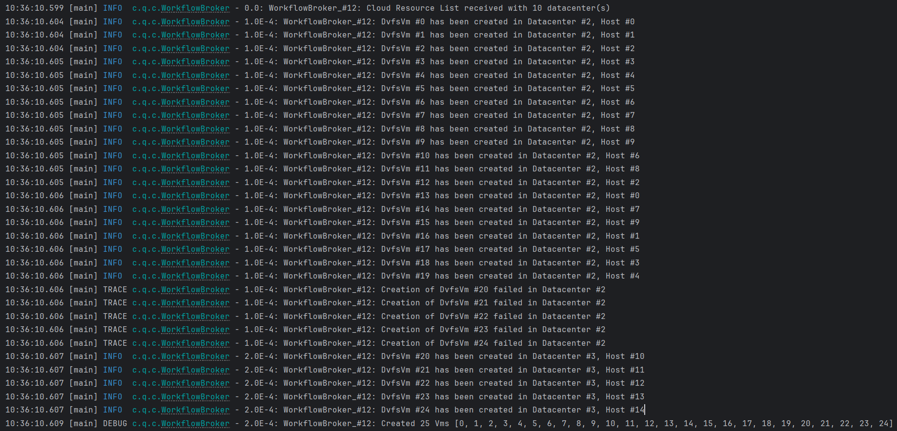
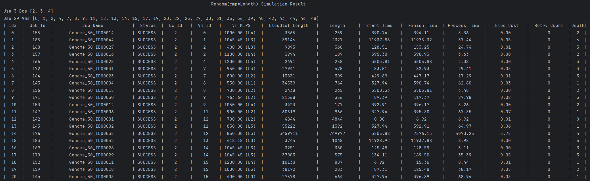
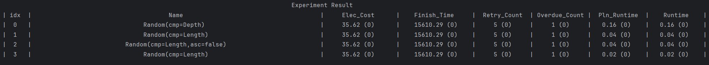
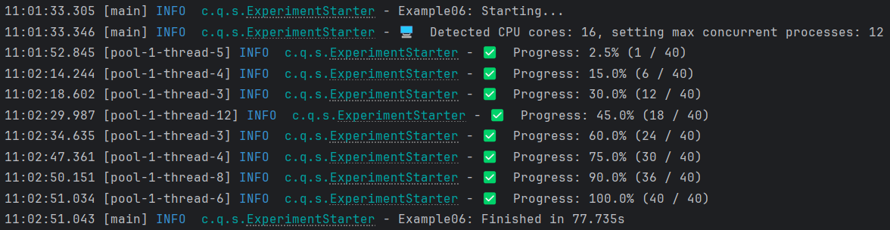

# A Simulation Framework for Cloud Workflow Scheduling Based on CloudSim

## Features

- Supports multi-workflow scheduling across geo-distributed data centers
- Supports Dynamic Voltage and Frequency Scaling (DVFS), with consideration for transient faults induced by DVFS technology
- Supports a job retry mechanism that automatically re-executes jobs upon transient fault occurrences
- Supports the generation of various types of workflow instances, such as Montage, Genome, and more. Additionally, the number of jobs in a workflow can be customized
- Supports workflow parsing and displays the workflow structure graph

- Supports visualization of simulation results, showing the entire simulation process as a Gantt chart

- Supports multiple levels of logging and generates corresponding log files

- Supports printing of both simulation and experimental results to the console

- Support multi-factor ANOVA
- Support parallel simulation

