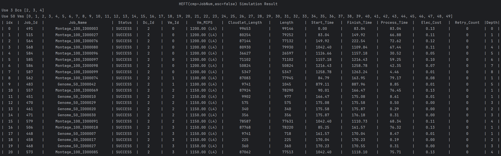
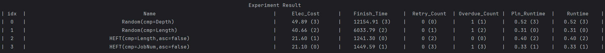
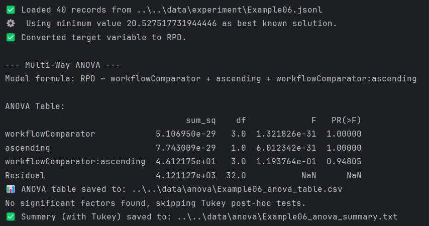

# A Simulation Framework for Cloud Workflow Scheduling Based on CloudSim

## Features

- Support multi-workflow scheduling across geo-distributed data centers
- Support Dynamic Voltage and Frequency Scaling (DVFS), with consideration for transient faults induced by DVFS
  technology
- Support a job retry mechanism that automatically re-executes jobs upon transient fault occurrences
- Support the generation of various types of workflow instances, such as Montage, Genome, and more. Additionally, the
  number of jobs in a workflow can be customized
- Support workflow parsing and displays the workflow structure graph

- Support visualization of simulation results, showing the entire simulation process as a Gantt chart

- Support multiple levels of logging and generates corresponding log files

- Support printing of both simulation and experimental results to the console

- Support parallel simulation

- Support multi-factor ANOVA

